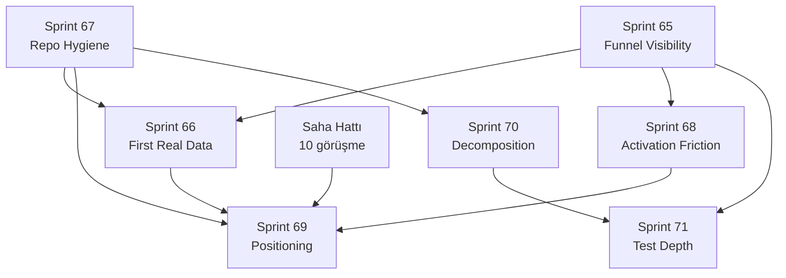

# feedl — Revizyon Planı (Sprint'lere Bölünmüş)

> **Kaynak:** `glm_analyse.md` (2026-09-13 proje durum analizi)
> **Tarih:** 2026-09-13 · **HEAD:** `ebcdc57` · **Son sprint:** 64
> **Yeni sprint aralığı:** **65 → 71** + paralel saha hattı

---

> **DURUM (2026-09-13, son güncelleme):** Sprint 65–70 **TAMAMLANDI**; Sprint 71'in
> kodla kapanabilen maddeleri **TAMAMLANDI**. Kalan üç madde altyapı/kullanıcı
> aksiyonu gerektirir (§13).
>
> | Sprint | Durum | Kanıt |
> |---|---|---|
> | 65 Funnel Visibility | ✅ | `analytics_events` (mig 0062) + `after()` yazımı + 7 olay + panel |
> | 66 First Real Data | ✅ | 14 fikir/4 şirket/3 fırsat canlıda; izolasyon + AI 14/14 |
> | 67 Repo Hygiene | ✅ | `feedl-docs` yedeği; Dependabot 0 açık; SKILL.md temiz; vite 6 pin |
> | 68 Activation Friction | ✅ | `is_sample` (mig 0063) + örnek veri onboarding + CSV yazar hatası düzeltildi |
> | 69 Positioning | ✅ | **TR-first kararı** + TL fiyat (env-gated) + hesap Pro/deneme notları |
> | 70 Decomposition | ✅ | inngest 1→9 dosya; dashboard 1246→688+498; companies → 5 dosya |
> | 71 Test Depth | 🟡 | 71.1 ✅ · 71.4 ✅ · 71.6 ✅ · 71.7 ✅ · 71.2/71.3/71.5 ⏸️ (§13) |
> | ∥ Saha Hattı | ⏸️ | 20 görüşme — kodla yapılamaz |

---

## 0. Planlama İlkeleri

Bu plandaki sıralama üç kurala göre kurulmuştur:

1. **Önce ölç, sonra düzelt.** Funnel ölçümü (Sprint 65) her şeyden önce gelir; çünkü
   ölçüm olmadan yapılan hiçbir ürün değişikliğinin etkisi görülemez.
2. **Kod işi saha işini bekler.** Rapordaki en büyük risk "mühendislik konfor alanı".
   Bu yüzden sprint'ler **küçük tutuldu** ve saha hattı (görüşmeler) paralel yürür.
3. **Deploy bütçesi bir kısıttır.** `main`'e push = 1 Vercel deploy (Hobby ~100/24s).
   Her sprint **tek push**'ta biter (`docs/standarts.md` §6). Bu yüzden `docs/`
   klasörü ana repo'da versiyonlanMAZ (bkz. Sprint 67).

### İş kolları

| Kol | İçerik | Tip |
|---|---|---|
| **A — Ölçüm** | Funnel olayları, activation visibility | Kod |
| **B — Kanıt** | Dogfooding, saha görüşmeleri, ilk gerçek veri | Kod + saha |
| **C — Hijyen** | Repo/doküman/skill/dependabot | Kod |
| **D — Aktivasyon** | Sürtünme azaltma, CSV, örnek veri | Kod |
| **E — Konumlandırma** | Pazar kararı, pricing dili | Karar + kod |
| **F — Ölçek borcu** | Refactor, test derinliği | Kod |

### Sprint ↔ Rapor eşlemesi

| Sprint | Ad | Rapor referansı | Öncelik |
|---|---|---|---|
| 65 | Funnel Visibility | §3.3, R2 | **P0** |
| 66 | First Real Data (dogfood) | §3.5, §3.2-adım3, R4 | **P0** |
| 67 | Repo Hygiene | §4.8, §5.2, §7, R3, R10 | **P0** |
| 68 | Activation Friction | §3.2, R2 | **P1** |
| 69 | Positioning Decision | §3.4, §3.6, R5 | **P1** |
| 70 | Decomposition | §4.3, P2 | **P2** |
| 71 | Test Depth | §4.5, §4.6, R8, R9 | **P2** |
| ∥ | Saha Hattı (görüşmeler) | §8-P1/6, M1 | **P0 (bloklayıcı)** |

---

## 1. Bağımlılık Sırası

**Kritik yol:** `65 → 66 → 68 → 69` (ürün öğrenme hattı).
`67`, `70`, `71` bağımsızdır; sıkıştığında öne/arkaya alınabilir.

---

## 2. Sprint 65 — Funnel Visibility

> **Hedef:** Aktivasyon hunisinin her adımını ölçülebilir kılmak. Bugün yalnız
> `page_view` ölçülüyor; 13 adımlı funnel'ın **hiçbir adımı** kaydedilmiyor.
> **Çıkış kriteri:** Yeni bir workspace kurulduğunda 7 funnel olayı DB'ye düşüyor ve
> dashboard'da okunabiliyor.

### 65.0 Mimari karar — ölçüm nereye yazılacak?

Üç seçenek değerlendirildi:

| Seçenek | Artı | Eksi | Karar |
|---|---|---|---|
| GA4 client event | Hazır altyapı, ücretsiz | Ad-blocker kaybı, 3. taraf, sorgulanamaz, PII riski | ⚠️ Yalnız ziyaretçi tarafı |
| GA4 Measurement Protocol (server) | Tarayıcıdan bağımsız | Yeni sır (`GA_API_SECRET`), vendor lock, gecikme | ❌ |
| **First-party `analytics_events` tablosu** | Sorgulanabilir, tenant-scoped, PII kontrolü bizde, ad-blocker'dan etkilenmez, Neon'da ~bedava | Migration + kod | ✅ **Birincil** |

**Karar (öneri):** Birincil kaynak **first-party tablo**; `visitor`/`signup` gibi
anonim üst-funnel adımları ayrıca GA4'e mirror edilir (client).

### Görevler

| ID | Görev | Dokunulan dosyalar | Yaklaşım | Süre |
|---|---|---|---|---|
| 65.1 | `analytics_events` tablosu | `migrations/0062_analytics_events.sql`, `tools/apply-0062.mjs`, `lib/db/schema.ts` | `id`, `workspace_id` (nullable), `user_id` (nullable), `name`, `props jsonb`, `created_at` + `(name, created_at)` ve `(workspace_id, created_at)` index | 1 s |
| 65.2 | Sunucu logger | `lib/analytics/events.ts` (yeni) | `trackEvent(name, {workspaceId, userId, props})` — **fire-and-forget**, asla isteği kırmaz (`catch` + Sentry `area=analytics`); event adları typed union | 1 s |
| 65.3 | Event taksonomisi | aynı dosya | `signup`, `workspace_created`, `feedback_added`, `customer_linked`, `revenue_added`, `priority_viewed`, `upgrade_clicked` + `visitor` (client) | 0.5 s |
| 65.4 | Çağrı yerleri (server) | `app/api/webhooks/clerk/route.ts` (signup), `app/api/onboarding/route.ts` (workspace_created), `app/api/posts/route.ts` + `app/api/widget/posts/route.ts` (feedback_added), `app/api/admin/companies/route.ts` (customer_linked), `app/api/admin/opportunities/route.ts` (revenue_added) | Her handler'ın başarı yolunda **tek satır** | 2 s |
| 65.5 | `priority_viewed` | `app/(main)/portal/[id]/page.tsx`, `app/(main)/dashboard/page.tsx` | Sunucu render'da (RSC) track — Pro'da gelir skoru görüntülenmesi | 1 s |
| 65.6 | `upgrade_clicked` | `components/custom/pricing-manager.tsx`, `components/custom/billing-overview.tsx` | Client `track()` + GA mirror | 1 s |
| 65.7 | Client yardımcı + GA mirror | `lib/analytics/client.ts` (yeni), `components/custom/google-analytics.tsx` | `track(name, props)` → `gtag('event', ...)`; `GA_ID` yoksa no-op | 1 s |
| 65.8 | Okuma yüzeyi | `app/(main)/dashboard/insights/page.tsx` veya yeni `dashboard/activation` | Sade tablo: adım başına sayı + dönüşüm oranı (SQL aggregate) | 2 s |
| 65.9 | PII disiplini + Privacy | `lib/analytics/events.ts`, `app/(main)/privacy/page.tsx` | **E-posta/ad asla yazılmaz**; yalnız id'ler + sayısal prop'lar. Privacy §6'ya "birinci taraf ürün analitiği" cümlesi | 0.5 s |
| 65.10 | Test | `tests/lib/analytics-events.test.ts` (yeni) | Event adı whitelist'i, PII prop reddi, hata yutma | 1 s |

**Toplam:** ~11 saat (1.5 gün)

**Doğrulama:** `tsc` + `vitest` + `build` + (Neon test branch'inde) migration apply →
onboarding akışı → `select name, count(*) from analytics_events group by 1`.
**Push:** tek commit, tek push.

---

## 3. Sprint 66 — First Real Data (Dogfooding)

> **Hedef:** Kendi portalını gerçek veriyle doldurmak. Üç riski tek hamlede kapatır:
> boş portal (R4), içerik düzeyi tenant kanıtı (§3.5), AI hattının gerçek veriyle ilk koşusu.
> **Çıkış kriteri:** `feedl.app/portal`'da ≥12 gerçek fikir, ≥3'ü şirket/MRR bağlı;
> `deneme.feedl.app` ile içerik ayrışması kanıtlı.

| ID | Görev | Detay | Süre |
|---|---|---|---|
| 66.1 | Backlog aktarımı | `docs/` ve raporlardaki açık işleri kendi portalına gerçek fikir olarak gir (≥12) | 1.5 s |
| 66.2 | Gelir bağlamı | 3-5 şirket kaydı + MRR + en az bir fırsat (`/dashboard/companies`) | 1 s |
| 66.3 | Oy + yorum | Kendi fikirlerinize gerçekçi oy/yorum (boş sosyal kanıt olmasın) | 0.5 s |
| 66.4 | **İçerik izolasyon kanıtı** | `deneme.feedl.app/portal`'a 1 fikir → `feedl.app/portal`'da **görünmediğini** doğrula; sonucu README #11'e yaz | 0.5 s |
| 66.5 | AI hattı gözlemi | Autopilot'un etiket/özet/duygu/benzerlik ürettiğini **gerçek** kayıtta doğrula; hatalı çıktı varsa not | 1 s |
| 66.6 | Kanıt kaydı | Ekran/DB çıktısıyla README'yi güncelle (boş-portal durumu artık geçersiz) | 0.5 s |

**Toplam:** ~5 saat
**Bağımlılık:** Sprint 65 (olaylar dogfood'u ölçebilsin), Sprint 67 (README düzeni).

> ⚠️ Bu sprint **kod içermez**. Rapordaki "Sprint 66 = P0 dogfood" maddesinin özü:
> ürün kendi ürününü kullanmaya başlasın.

---

## 4. Sprint 67 — Repo Hygiene

> **Hedef:** Kurumsal hafızayı güvenceye almak + birikmiş bakım borcunu kapatmak.
> **Çıkış kriteri:** 0 kırmızı Dependabot PR, `docs/` yedekli, `SKILL.md` güncel ve
> markasız.

| ID | Görev | Dokunulan | Yaklaşım | Süre |
|---|---|---|---|---|
| 67.1 | **`docs/` versiyonlama** | yeni repo `feedl-docs` (private) | `docs/`'u ayrı private repo'ya al. **Ana repo'ya geri koyMA:** her push Vercel deploy tetikler ve belgelenmiş 100/24s bütçesini yakar (gitignore'un asıl gerekçesi). Ayrı repo = deploy tetiklemez, yine de yedeklenir | 1 s |
| 67.2 | `.gitignore` gerekçe notu | `.gitignore` | "neden untracked" yorumunu netleştir (deploy bütçesi), böylece gelecekte yanlışlıkla geri eklenmez | 0.25 s |
| 67.3 | Dependabot: merge | GH | #3 (`@eslint/eslintrc` patch), #4 (`@clerk/testing` patch), #7 (`vite` 8) → merge | 0.5 s |
| 67.4 | Dependabot: kapat | GH | #5 (react major — `19.2.8` **tam sabit**, SKILL kuralı), #6 (`eslint-config-next` 16 = Next 16 gerektirir, Next 15.5'te alınamaz) → **kapat + gerekçe yorumu** | 0.25 s |
| 67.5 | Dependabot kural | `.github/dependabot.yml` (yeni veya güncelle) | `react`/`@types/react` ve `eslint-config-next` için **major** bump'ları ignore et; patch/minor açık kalsın | 0.5 s |
| 67.6 | **`SKILL.md` marka temizliği** | `.agents/skills/feedl/SKILL.md` satır 3, 9, 29 | "Canny clone" ifadelerini nötrle; `docs/archive/canny.md` referansını kaldır | 0.25 s |
| 67.7 | `SKILL.md` mimari tazeleme | aynı dosya (middleware + rol bölümleri) | `createRouteMatcher` anlatımı → `lib/auth/public-paths.ts` fail-closed allowlist; rol kademesi `contributor` → **owner/manager/member** | 0.5 s |
| 67.8 | `docs/archive/canny.md` | docs repo | Arşivden çıkar **veya** dosyayı sil (yasal hijyen); karar sahibine sor | 0.1 s |
| 67.9 | README tazeliği | `README.md` | §4.8 & §2.4'teki "0 Dependabot PR" satırını gerçekle hizala | 0.25 s |

**Toplam:** ~3.5 saat
**Doğrulama:** `gh pr list --state open` → 0 · `gh api .../dependabot/alerts` → 0 (güvenlik zaten 0).

---

## 5. Sprint 68 — Activation Friction

> **Hedef:** Raporda **R2** olarak işaretlenen 8 adımlı aktivasyon zincirini kısaltmak.
> Gelir skoru bugün "şirket aç → MRR gir → fırsat gir → bağla" istiyor; bunu
> Free kullanıcı için 2 adıma indirmek.
> **Çıkış kriteri:** Yeni bir Free workspace, kurulumdan ~2 dakika sonra **anlamlı**
> bir gelir skoru görüyor (örnek veriyle), kendi verisini girme yolu açık.

| ID | Görev | Dokunulan | Yaklaşım | Süre |
|---|---|---|---|---|
| 68.1 | **Örnek veri modu** | `lib/db/sample-data.ts` (yeni), `app/api/onboarding/route.ts` | Kurulumda "örnek veriyle başla / boş başla" seçeneği. Örnek: 1 demo şirket + 2 fırsat + 3 fikir + oy. **Açıkça "Örnek" etiketli**, tek tıkla silinebilir | 1 gün |
| 68.2 | Örnek veri temizliği | `app/api/admin/sample-data/route.ts` (yeni) | `DELETE` — workspace-scoped, owner/manager yetkili, gerçek veriye dokunmaz (`is_sample` flag) | 2 s |
| 68.3 | Onboarding UX | `app/(main)/onboarding/*` | İki net yol: "2 dakikada dene" / "kendi verimle başla" | 0.5 gün |
| 68.4 | **CSV import gerçek testi** | `app/api/admin/import/route.ts`, `lib/db/import.ts` | Gerçek bir CSV (≥20 satır, eksik alan, bozuk satır, tekrar e-posta, TR karakter) ile uçtan uca; bulunan hatalar düzeltilir | 4 s |
| 68.5 | CSV hata raporu UX | aynı | Satır bazlı hata mesajı (kaç satır eklendi/atlandı/neden) | 2 s |
| 68.6 | Empty-state yönlendirme | `components/custom/` (ilgili yerler) | Gelir skoru boşken "örnek veriyle nasıl görünür" bağlantısı | 1 s |
| 68.7 | Test | `tests/lib/import.test.ts`, `tests/lib/sample-data.test.ts` | CSV edge case + örnek veri silme izolasyonu | 2 s |

**Toplam:** ~2.5 gün
**Bağımlılık:** Sprint 65 (örnek veri akışı da event üretmeli), 66 (dogfood ile UX doğrulama).

---

## 6. Sprint 69 — Positioning Decision

> **Hedef:** Raporda **R5** olarak işaretlenen dil/pazar kararsızlığını kapatmak ve
> pricing dilindeki tek tutarsızlığı gidermek.
> **Çıkış kriteri:** Hedef pazar **yazılı bir karara** bağlı; pricing'de hesap düzeyi Pro
> açıklanmış.

| ID | Görev | Detay | Süre |
|---|---|---|---|
| 69.1 | **Karar briefi** | TR-first mi EN-first mi? Kanıt: saha görüşmelerinin dili/konumu, ilk 10 kullanıcının profili. Tek sayfalık karar + gerekçe (`docs/`) | 2 s (saha girdisiyle) |
| 69.2 | Kararın asgari uygulaması | **TR-first ise:** TRY gösterimi + yerel konumlandırma. **EN-first ise:** i18n iskeleti (`[locale]` + sözlük katmanı) + `<html lang>` dinamik | 1-3 gün (seçime bağlı) |
| 69.3 | Pricing: hesap düzeyi Pro | `lib/plan-copy.ts`, `components/custom/pricing-manager.tsx` | "Bir workspace'in Pro ise, sahip olduğun diğer workspace'ler de Pro" tek cümle (§3.4) | 0.5 s |
| 69.4 | Fiyat/deneme netliği | `app/(main)/pricing/page.tsx`, `docs/free-pro_plans.md` (§7) | "14 gün ücretsiz deneme" ≠ "14 gün cayma hakkı" ayrımını UI'da netleştir | 0.5 s |
| 69.5 | Landing ↔ pricing uyumu | `app/(main)/page.tsx` | §3.4'teki Free/Pro dil birliğinin son kontrolü (AI Autopilot vs AI Insights) | 0.5 s |
| 69.6 | Test | `tests/lib/paddle-plans.test.ts` + pricing testleri | Plan metni/limit tutarlılığı | 1 s |

**Toplam:** 2-4 gün (69.2 seçime bağlı)
**Bağımlılık:** Saha hattı + Sprint 66 (kendi kullanımımız da bir veri noktası).

> ⚠️ **69.1 saha girdisi olmadan yapılmamalı.** Erken verilen pazar kararı, i18n gibi
> pahalı bir yatırımı yanlış yöne kanalize eder.

---

## 7. Sprint 70 — Decomposition (Ölçek Borcu)

> **Hedef:** Raporda §4.3'te işaretlenen üç büyük dosyayı bölmek. **Davranış
> değişmez**, yalnız okunabilirlik/bakım maliyeti düşer.
> **Çıkış kriteri:** Tüm testler aynı sonuçla yeşil; hiçbir feature değişmemiş.

| ID | Görev | Dokunulan | Yaklaşım | Süre |
|---|---|---|---|---|
| 70.1 | Inngest bölünmesi | `inngest/functions.ts` (1256) → `inngest/functions/{autopilot,notify,digest,webhooks}.ts` | Fonksiyonları sorumluluklarına göre ayır; `index.ts` barrel export | 1 gün |
| 70.2 | Dashboard sayfası bölünmesi | `app/(main)/dashboard/page.tsx` (1246) → veri yükleyiciler `lib/dashboard/*`, görünümler bileşenlere | RSC veri çekme ile görünümü ayır | 1 gün |
| 70.3 | Companies manager bölünmesi | `components/custom/companies-manager.tsx` (1100) → liste / form / import | `use client` sınırını koru | 1 gün |
| 70.4 | Regresyon kilidi | mevcut testler + `e2e` | Refactor öncesi/sonrası aynı test sonucu; davranış değişikliği yok | — |

**Toplam:** ~3 gün
**Kural:** Bu sprint **yeni özellik içermez**. Bir bug bulunursa ayrı commit'te, ayrı
notta düzeltilir.

---

## 8. Sprint 71 — Test Depth

> **Hedef:** Raporda §4.5/§4.6 ve R8/R9 olarak işaretlenen doğrulama boşluklarını kapatmak.
> **Çıkış kriteri:** DB-backed entegrasyon testleri koşuyor; auth e2e gerçekten çalışıyor;
> ölçek davranışı sayıyla biliniyor.

| ID | Görev | Detay | Süre |
|---|---|---|---|
| 71.1 | **DB-backed entegrasyon test katmanı** | Neon **test** branch'i (`ep-gentle-bonus…`) üzerinde: migration apply → gerçek şema → kritik akış (post oluştur → vote → skor) | 2 gün |
| 71.2 | Migration regresyonu | 62 migration'ın temiz bir branch'te sıfırdan uygulanabildiğini kanıtlayan script (`tools/verify-migrations.mjs`) | 4 s |
| 71.3 | **Auth e2e gerçek koşu** | Clerk **test/dev instance** + Fakes + `tools/seed-e2e.mjs` → 3 skip kapanır | 4 s |
| 71.4 | Yük provası | 10k post + pgvector benzerlik + 100 eşzamanlı oy; darboğaz ölçümü | 1 gün |
| 71.5 | Custom domain uçtan uca | Gerçek domain: TXT doğrulama → Vercel bağlama → apex A kaydı → traffic ready | 4 s (dış DNS) |
| 71.6 | Yeni e2e: `/survey` + host kapısı | `e2e/` — `deneme.feedl.app/survey` 404, kök 200 (birim test var, e2e yok) | 2 s |
| 71.7 | Sonuç kaydı | README test tablosu güncelle | 0.5 s |

**Toplam:** ~4.5 gün
**Bağımlılık:** 70 (bölünmüş kod test edilmesi daha kolay).

---

## 9. ∥ Saha Hattı (Paralel — Kod Değil)

> Rapordaki en kritik ve **en yüksek getirili** iş. Sprint'ler bunu **bloklamaz**, paralel
> yürür. M1 (Problem Evidence) çıkış kriteri bunlara bağlıdır.

| ID | Görev | Kaynak kriter |
|---|---|---|
| F.1 | İlk 20 görüşme adayını listele | `FEEDL-ROADMAP.md` §M1 |
| F.2 | **20 görüşme** yap | "20 görüşme" |
| F.3 | 5+ tekrarlayan acı sinyali topla | "5+ recurring pain signal" |
| F.4 | 3+ somut ekonomik etki örneği | "3+ somut ekonomik etki örneği" |
| F.5 | 3+ mevcut çözümün yetersizliği | "3+ mevcut çözüm yetersiz" |
| F.6 | 3+ ciddi satın alma sinyali | "3+ buying signal" |

**Çıktı:** Görüşme notları `docs/` (→ `feedl-docs` repo'su) + Sprint 69.1 karar briefi.
**Ölçüm:** Funnel olayları (Sprint 65) ile saha bulguları **yan yana** okunur.

---

## 10. Zaman Çizelgesi (önerilen)

| Hafta | Kod hattı | Saha hattı |
|---|---|---|
| 1 | Sprint 65 (ölçüm) → Sprint 67 (hijyen) | F.1 aday listesi |
| 2 | Sprint 66 (dogfood) | F.2 görüşmeler başlar |
| 3 | Sprint 68 (aktivasyon) | F.2 devam |
| 4 | Sprint 69 (konumlandırma) | F.3-F.5 bulgular |
| 5 | Sprint 70 (decomposition) | F.6 satın alma sinyalleri |
| 6 | Sprint 71 (test derinliği) | Karar briefi → 69.1 |

**Her sprint tek push** ile biter (deploy bütçesi). Ara doğrulama: `tsc` + `vitest` +
`lint` + `build` + (gerekirse) `e2e`.

---

## 11. Bilinçli Olarak YAPILMAYACAKLAR

| Yapılmayacak | Gerekçe |
|---|---|
| ❌ CRM/Stripe/Salesforce entegrasyonu | Rule 2 — manual first; önce CSV kanıtı (68.4) |
| ❌ Mikroservise bölme | Rule 6 — darboğaz yok |
| ❌ i18n altyapısı (karar öncesi) | Sprint 69.1 beklenir |
| ❌ Yeni ürün özelliği | Rule 1 — kanıt yoksa feature yok |
| ❌ `docs/`'u ana repo'ya geri koymak | Her push Vercel deploy yakar (100/24s bütçesi) |
| ❌ React / Next major yükseltmesi | `19.2.8` tam sabit; Next 15.5 hattı kilitli |
| ❌ Uptime monitörü | Kullanıcı kararı — gerekmiyor |

---

## 12. Genel Çıkış Kriterleri (Plan Sonu)

Plan tamamlandığında şunlar doğru olmalı:

- [ ] Aktivasyon hunisinin **7 adımı** DB'de ölçülüyor ve dashboard'da okunuyor.
- [ ] `feedl.app/portal` **boş değil** (≥12 gerçek fikir, gelir bağlamı dolu).
- [ ] `docs/` yedekli (ayrı private repo), `SKILL.md` güncel ve markasız.
- [ ] Açık Dependabot PR = **0** (güvenlik uyarısı zaten 0).
- [ ] Yeni kullanıcı **~2 dakikada** anlamlı gelir skoru görüyor.
- [ ] CSV import gerçek veriyle doğrulanmış.
- [ ] Hedef pazar **yazılı karara** bağlı.
- [ ] Üç büyük dosya bölünmüş, davranış değişmemiş.
- [ ] DB-backed testler + auth e2e + yük provası + custom domain provası tamam.
- [ ] **20 müşteri görüşmesi** yapılmış (M1 çıkışı).

---

*Hazırlayan: Zed agent · 2026-09-13 · Kaynak: `glm_analyse.md`*

---

## 13. Kalan İşler (altyapı/kullanıcı aksiyonu gerektirir)

| # | İş | Neden bekliyor | Yapılacak |
|---|---|---|---|
| 71.2 | Migration'ları SIFIRDAN doğrulama | Boş bir veritabanı gerekir; üretimde çalıştırılamaz | Yeni bir Neon branch aç → `DATABASE_URL=<branch> bash -c 'for f in migrations/*.sql; do psql "$DATABASE_URL" -f "$f"; done'`. Alternatif: branch'i CI'da bos açıp tüm migration'ları uygulayan bir job. |
| 71.3 | Auth e2e'nin GERÇEKTEN koşması (3 skip kapanır) | Clerk **test/dev** instance + Fakes gerekir (gizli anahtar) | README'deki 4 adım (Clerk Fakes + webhook + `tools/seed-e2e.mjs` + `npm run test:e2e`). |
| 71.5 | Custom domain uçtan uca provası | Gerçek bir domain + DNS erişimi gerekir | `test.feedl.app` KULLANILAMAZ; başka bir domain al → `_feedl.<domain>` TXT → Vercel'e ekle → apex için A kaydı. |
| ∥ | 20 müşteri görüşmesi (M1) | Saha işi | `docs/FEEDL-ROADMAP.md` M1 çıkış kriterleri. |
| — | Onboarding örnek veri akışının **interaktif** doğrulaması | Tarayıcı gerektirir (ajan tıklayamaz) | Yeni hesapla `/onboarding` → "Örnek verilerle göster" işaretli → pane + gelir skoru dolu mu? Sonra "Veri ve gizlilik"ten kaldır. |
| — | Workspace silme akışının canlı provası | Tarayıcı gerektirir | `/dashboard/workspaces` → Geç → "Veri ve gizlilik" → sil (`deneme` silinebilir). |
